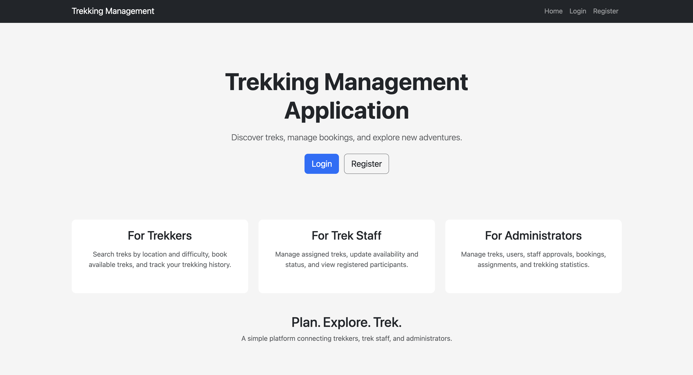
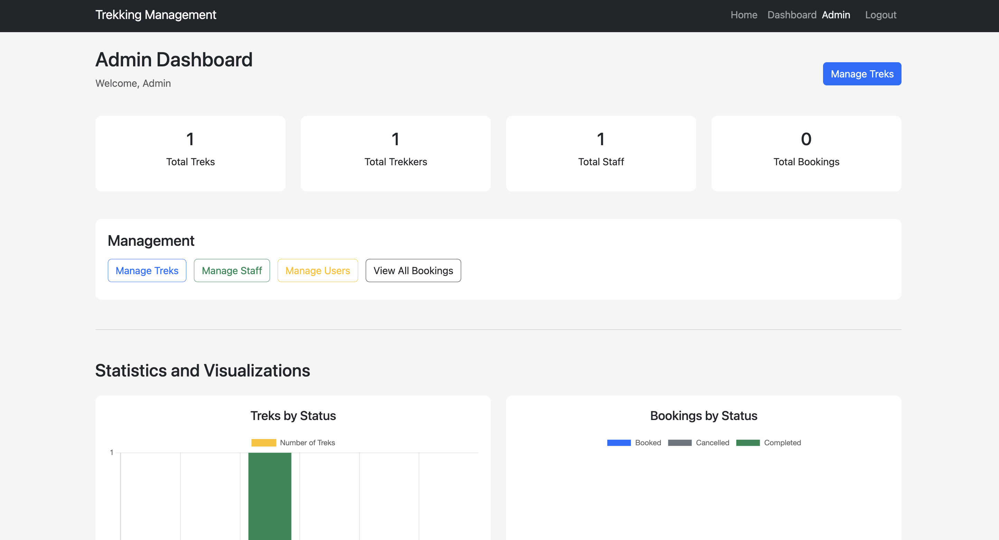

# Trekking Management Application (TMA)

Trekking Management Application is a role-based web application developed as part of the IIT Madras BS Degree MAD-I project.

The application allows administrators, trek staff, and trekkers to manage trekking activities, staff assignments, participant bookings, trek availability, and trekking history.

---

## Screenshots

### User Experience

<p align="center">
  
</p>

### Admin Dashboard

<p align="center">
  
</p>

---

## Features

Trekking Management Application provides role-based functionality for managing treks, staff, users, and bookings.

### Admin Features

* **Admin Dashboard:** View application statistics and important trekking information.
* **Trek Management:** Create, edit, and delete treks.
* **Staff Management:** Approve and manage trek staff and assign staff to treks.
* **User Management:** Manage users and blacklist users when required.
* **Booking Management:** View and manage all trek bookings.
* **Search and Filtering:** Search users, staff, and treks.
* **Statistics & Visualization:** View trekking statistics using charts and data visualizations.

### Trek Staff Features

* **Staff Registration:** Register and log in after administrator approval.
* **Assigned Treks:** View treks assigned by the administrator.
* **Trek Management:** Update available slots and trek status.
* **Participant Management:** View registered participants for assigned treks.
* **Trek Status:** Mark treks as started or completed.
* **Profile Management:** Edit staff profile information.

### Trekker Features

* **User Registration:** Register and create a trekker account.
* **Authentication:** Log in to access trekker functionality.
* **Trek Browsing:** View available open treks.
* **Search & Filtering:** Search and filter available treks.
* **Trek Booking:** Book available treks while preventing overbooking.
* **Booking Cancellation:** Cancel existing bookings.
* **Booking History:** View booking status and trekking history.
* **Profile Management:** Edit profile information.

---

## Additional Features

* **Role-Based Access Control:** Different functionality is provided for Admin, Trek Staff, and Trekker roles.
* **Password Hashing:** User passwords are stored using password hashing.
* **Overbooking Prevention:** The application checks trek availability before creating a booking.
* **Booking History:** User bookings and trekking history are maintained.
* **REST API:** JSON API endpoints are available for trek, user, and booking operations.
* **Data Visualization:** Chart.js is used to display statistics on the admin dashboard.
* **Responsive Interface:** Bootstrap is used to provide a responsive frontend.
* **Frontend & Backend Validation:** User input is validated on both the frontend and backend.

---

## Tech Stack

The application is built using Flask, SQLAlchemy, SQLite, Jinja2, Bootstrap, and Chart.js.

### Backend

* **Language:** [Python](https://www.python.org/)
* **Framework:** [Flask](https://flask.palletsprojects.com/)
* **ORM:** [Flask-SQLAlchemy](https://flask-sqlalchemy.palletsprojects.com/)
* **Database:** SQLite

### Frontend

* **Template Engine:** Jinja2
* **Markup:** HTML
* **Styling:** CSS and [Bootstrap](https://getbootstrap.com/)
* **Data Visualization:** [Chart.js](https://www.chartjs.org/)

---

## Database

The application uses **SQLite** as its database and **Flask-SQLAlchemy** as the ORM used to interact with the database.

The database and required tables are created programmatically when the application is initialized.

The default administrator account is also created automatically.

### Default Admin Credentials

* **Email:** `admin@tma.com`
* **Password:** `admin123`

---

## Database Models

The application contains four main database models:

* **User**
* **StaffProfile**
* **Trek**
* **Booking**

These models are connected using SQLAlchemy relationships and foreign keys.

The `StaffProfile` model has a one-to-one relationship with `User`, while users, treks, and bookings are connected according to their respective relationships.

---

## API Endpoints

The application provides JSON API endpoints for:

* Retrieving treks
* Retrieving individual trek details
* Creating treks
* Updating treks
* Deleting treks
* Retrieving users
* Retrieving bookings

Trek modification through the API requires Admin authentication.

The API uses standard HTTP methods such as:

```text
GET     → Retrieve data
POST    → Create data
PUT     → Update data
DELETE  → Delete data
```

---

## Project Structure

```text
trekking-management-app/
├── app.py
├── models.py
├── requirements.txt
├── README.md
├── instance/
│   └── trekking.db
├── static/
│   ├── css/
│   │   └── style.css
│   └── ____________.png
└── templates/
    ├── base.html
    ├── index.html
    ├── login.html
    ├── register.html
    ├── admin/
    ├── staff/
    └── user/
```

---

## Main Files and Folders

* **`app.py`** — Main Flask application containing routes, authentication, sessions, database operations, and application logic.
* **`models.py`** — Contains the SQLAlchemy database models and their relationships.
* **`templates/`** — Contains Jinja2 HTML templates used to render the application's pages.
* **`static/`** — Contains static assets such as CSS and images.
* **`instance/`** — Contains the SQLite database.
* **`requirements.txt`** — Contains the Python dependencies required by the application.

---

## Installation and Running

### Prerequisites

* Python 3.x
* pip

### Installation

1. **Clone the repository:**
   ```bash
   git clone <your-repository-url>
   cd trekking-management-app
   ```

2. **Create a virtual environment:**
   ```bash
   python -m venv env
   ```

3. **Activate the virtual environment:**
   * On **macOS/Linux**:
     ```bash
     source env/bin/activate
     ```
   * On **Windows**:
     ```bash
     env\Scripts\activate
     ```

4. **Install dependencies:**
   ```bash
   pip install -r requirements.txt
   ```

5. **Run the application:**
   ```bash
   python app.py
   ```

6. **Open the application at:**
   ```text
   http://127.0.0.1:5000
   ```

---

## Application Workflow

The application follows a role-based workflow:

```text
User Registration
       ↓
     Login
       ↓
Role Verification
       ↓
┌──────────────┬──────────────┬──────────────┐
│    Admin     │  Trek Staff  │   Trekker    │
└──────────────┴──────────────┴──────────────┘
       ↓              ↓               ↓
 Manage Treks    Assigned Treks    Browse Treks
 Manage Users    Participants      Book Treks
 Manage Staff    Trek Status       Booking History
 View Bookings   Edit Profile      Edit Profile
 Statistics
```

---

## License

This project was developed as part of the IIT Madras BS Degree MAD-I project.

## Author

Ansh Rai